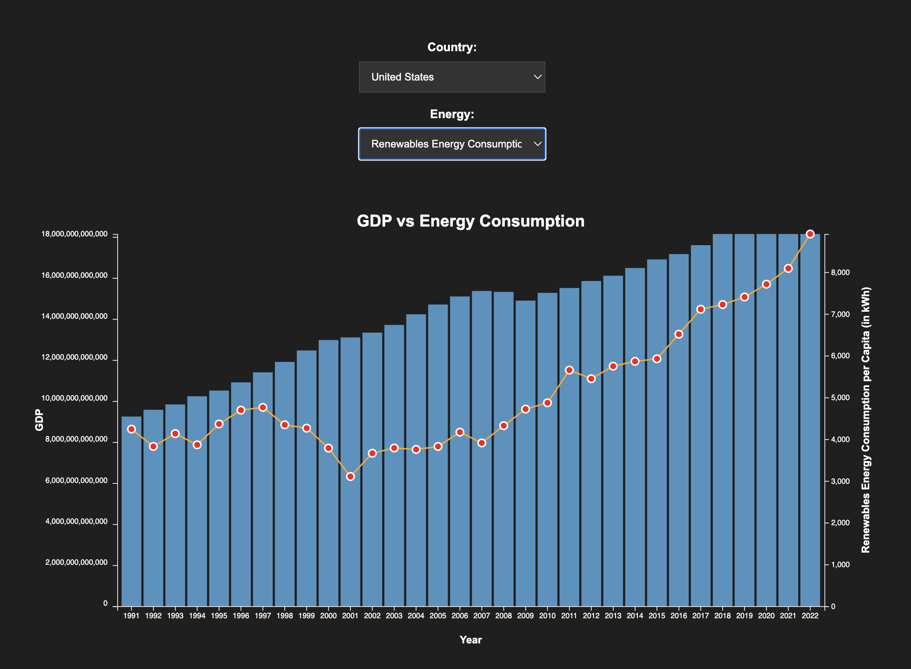
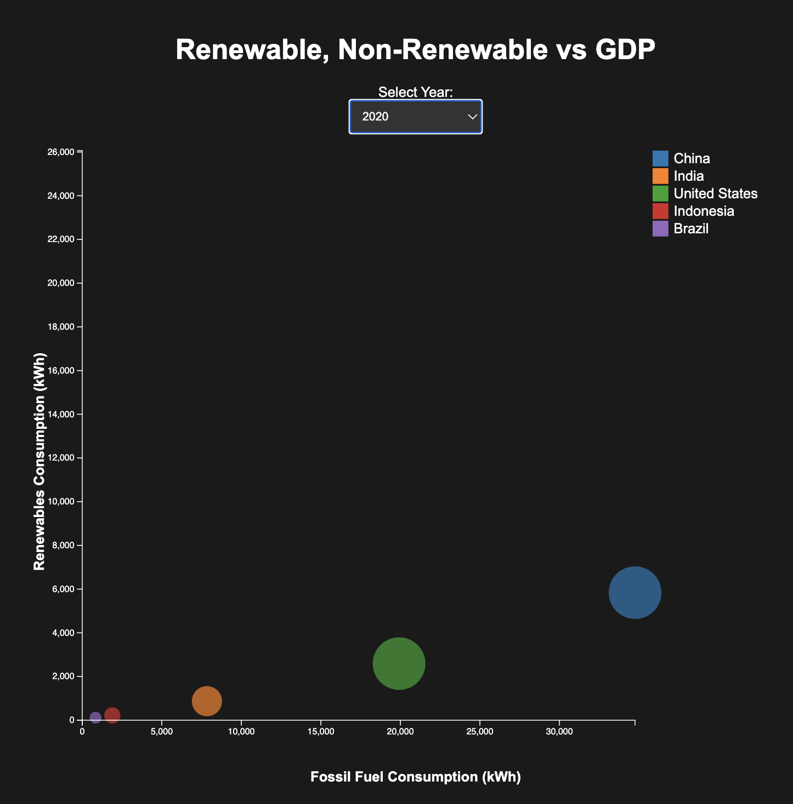
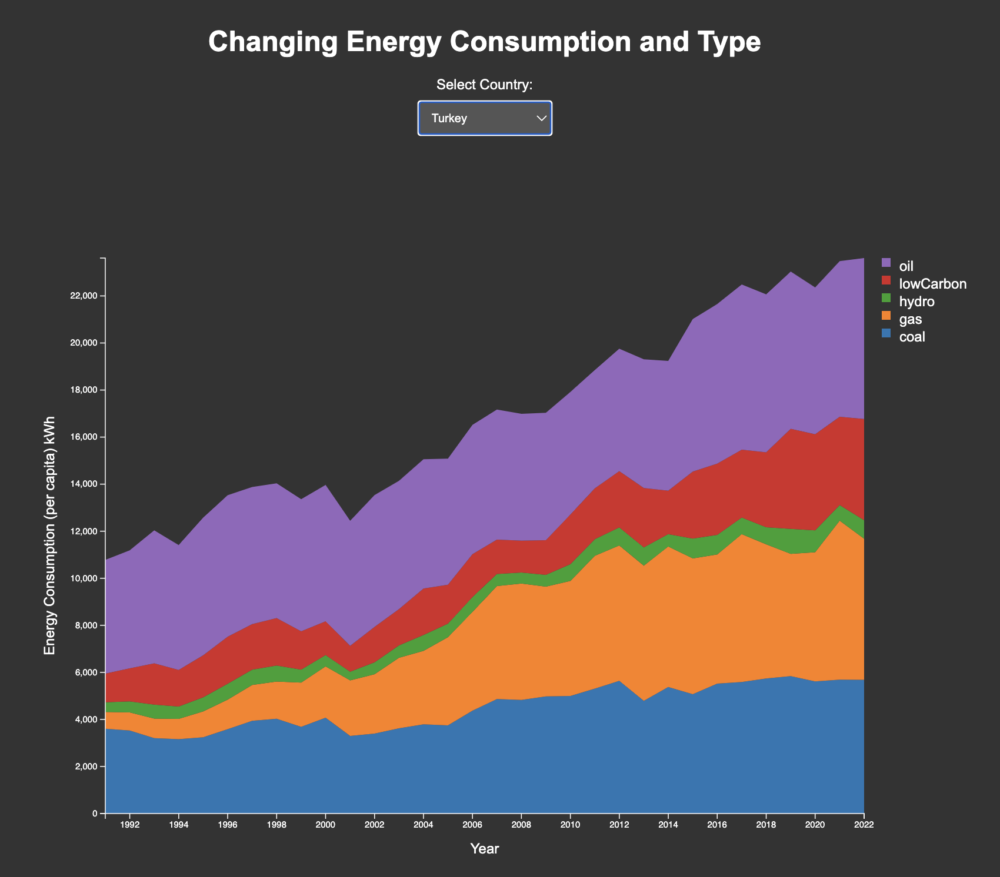

# World Energy Consumption Visualized

# Introduction

The "World Energy Consumption Visualized" project aims to offer a comprehensive and interactive exploration of the intricate relationship between a nation's energy consumption patterns and its economic prosperity. By leveraging a diverse set of visualizations, this project sheds light on the global distribution of GDP, energy consumption trends, and the impact of various energy sources on economies worldwide.

## ****Project Objectives****

1. **Global GDP Distribution:** Analyzing and visualizing the distribution of Gross Domestic Product (GDP) across different countries globally.
2. **Energy Consumption Influence:** Investigating how the world's energy consumption patterns influence the economic growth of nations.
3. **Energy Mix Analysis:** Delving into the composition of energy sources and their contributions to the daily lives of people around the globe.

## ****Data Source****

The project utilizes a robust dataset provided by *[Our World in Data](https://ourworldindata.org/energy)*, encompassing key metrics such as energy consumption (primary energy, per capita, and growth rates), energy mix, electricity mix, and more. The dataset is regularly updated and serves as a foundation for the visualizations presented in this project.

ref: [Kaggle](https://www.kaggle.com/datasets/pralabhpoudel/world-energy-consumption?resource=download)

## ****Visualizations Overview****

### **1. World Choropleth Map**

- **Objective:** Conveys the global distribution of GDP by color-coding countries on a choropleth map.
- **Insights:** Immediate visualization of countries' economic strengths and disparities, facilitating comparative analysis of GDP distribution globally.

    


### **2. Pareto Chart**

- **Objective:** Illustrates the relationship between a country's GDP and energy consumption over time.
- **Insights:** Allows for the correlation analysis between GDP and energy consumption trends, offering a comparative view for selected countries.

    


### **3. Bubble Chart**

- **Objective:** Compares fossil fuel consumption, renewable energy consumption, and GDP for the top 5 most populous countries.
- **Insights:** Provides a comparative analysis of fossil fuel and renewable energy consumption, exploring the relationship between energy consumption, GDP, and environmental sustainability.

    


### **4. Stacked Area Chart**

- **Objective:** Displays the composition of energy production for a selected country over time.
- **Insights:** Reveals trends in energy source distribution over the years and allows for a comparative analysis of the contribution of each energy type.

    


# ****Installation****

To explore and run the "World Energy Consumption Visualized" project locally, follow the steps below:

## **Prerequisites**

- Ensure you have a modern web browser installed (e.g., Google Chrome, Mozilla Firefox).
- Have a text editor or an integrated development environment (IDE) for reviewing and modifying code.

## **Steps**

1. **Clone the Repository:**
    - Open your terminal or command prompt.
    - Navigate to the directory where you want to clone the repository.
    - Run the following command:

        ```bash
        git clone git@github.com:Pradyothsp/dv-world-energy-consumption.git
        ```

2. **Navigate to the Project Directory:**
    1. Change your current directory to the cloned repository:

        ```bash
        cd dv-world-energy-consumption
        ```

3. **Host the Project:**
    - If you encounter issues with loading local files due to security restrictions, consider hosting the project using a local server.
    - You can use tools like Python's SimpleHTTPServer or Node.js's http-server for this purpose.

        For Python 2:

        ```bash
        python -m SimpleHTTPServer
        ```

        For Python 3:

        ```bash
        python -m http.server
        ```

        For Node.js (install it first if you haven't):

        ```bash
        npm install -g http-server
        http-server
        ```

    - Visit **`[http://localhost:8000](http://localhost:8000)`** (or another specified port) in your web browser.

By following these steps, you should be able to locally access and interact with the visualizations provided in the "World Energy Consumption Visualized" project. If you encounter any issues or have specific requirements, refer to the project's documentation or seek assistance in the respective community forums.

# Conclusion

In conclusion, the "World Energy Consumption Visualized" project has successfully leveraged a diverse set of visualizations to provide a nuanced understanding of the complex interplay between energy consumption patterns and economic prosperity on a global scale. Through the use of interactive charts and maps, the project has facilitated insightful observations and comparisons, contributing to a richer comprehension of the dynamics that shape our world.

## Key Insights

1. **Global Economic Disparities:** The World Choropleth Map has offered an immediate and vivid visualization of countries' economic strengths and disparities. By color-coding nations based on GDP values, users can readily identify and compare economic landscapes.
2. **Correlation between GDP and Energy Consumption:** The Pareto Chart has illuminated the correlation between a country's GDP and its energy consumption over time. This chart provides a prioritized display of contributing factors, aiding in efficient decision-making and policy formulation.
3. **Environmental Impact:** The Bubble Chart has effectively compared fossil fuel consumption, renewable energy consumption, and GDP for the top 5 most populous countries. This comparison offers insights into the environmental impact of energy choices and their relationship with economic prosperity.
4. **Temporal Trends in Energy Consumption:** The Stacked Area Chart has unveiled trends in energy source distribution over the years for a selected country. This visualization allows for a comparative analysis of the contribution of each energy type, offering valuable insights into evolving energy landscapes.

## Implications and Applications

- **Policy Formulation:** The insights derived from these visualizations can inform policymakers and stakeholders in making informed decisions related to energy policies, sustainability, and economic development.
- **Global Comparative Analysis:** The project enables a comparative analysis of energy and economic indicators across countries, fostering a deeper understanding of global trends and disparities.
- **Educational Tool:** The visualizations serve as educational tools, making complex data accessible and engaging for a wide audience, including students, researchers, and enthusiasts.

## Future Directions

As the project continues to evolve, potential future directions could include:

- **Real-time Data Integration:** Integrating real-time data sources to provide users with the most up-to-date information on global energy consumption and economic indicators.
- **Enhanced Interactivity:** Further enhancing the interactivity of visualizations, allowing users to customize and explore data based on specific criteria.
- **Mobile Responsiveness:** Optimizing the visualizations for mobile devices to ensure accessibility across a broader range of platforms.

In essence, the "World Energy Consumption Visualized" project stands as a testament to the power of data visualization in unraveling complex global phenomena. By providing a visual narrative of the intricate relationships between energy and economics, the project contributes to the broader conversation on sustainable development and the responsible utilization of global resources.

# References

1. [Our World in Data - Energy Dataset](https://ourworldindata.org/energy)
2. [Globe.gl - Interactive Globe Visualization](https://globe.gl/)
3. [Zebrabi - How to Customize Pareto Chart in D3.js](https://zebrabi.com/guide/how-to-customize-pareto-chart-in-d3-js/)
4. [D3.js Documentation](https://observablehq.com/@d3/stacked-area-chart/2)
5. Additional code snippets, resources, and inspirations are credited within the codebase and documentation.

These references have been instrumental in shaping and implementing the visualizations in the "World Energy Consumption Visualized" project. They serve as valuable sources for understanding D3.js, data visualization techniques, and best practices in presenting complex data in an accessible and informative manner.

# **License**

The "World Energy Consumption Visualized" project is released under the [MIT License](https://opensource.org/licenses/MIT).

This license grants users the freedom to use, modify, and distribute the software, subject to the conditions outlined in the MIT License. It ensures that users can freely interact with and build upon the project while providing proper attribution to the original authors.

# ****Contributors****

The "World Energy Consumption Visualized" project has been made possible through the collaborative efforts of the following contributors:

1. [Pradyoth S P](https://www.linkedin.com/in/pradyothsp/)
2. [Jeevan Ravi Kumar](https://www.linkedin.com/in/jeevan-achar/)
3. [Thanay Geeshpathy Narayanamurthy](https://www.linkedin.com/in/gnm-thanay/)